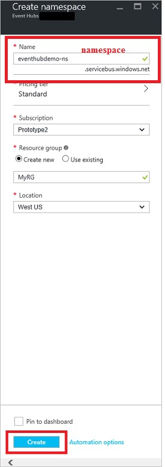
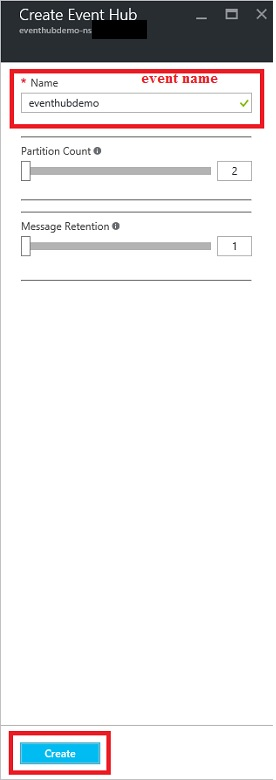
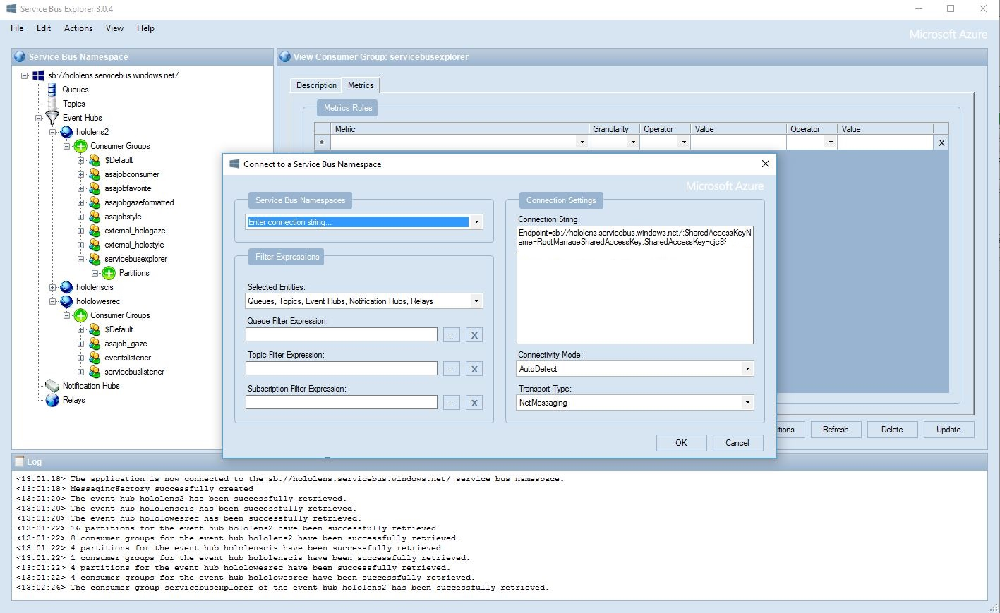
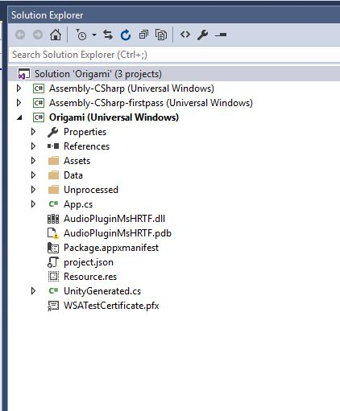
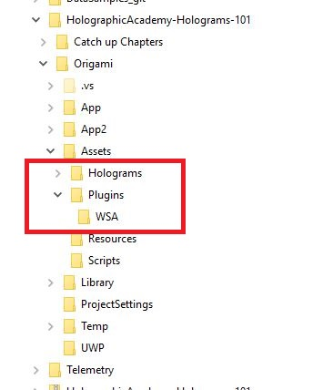
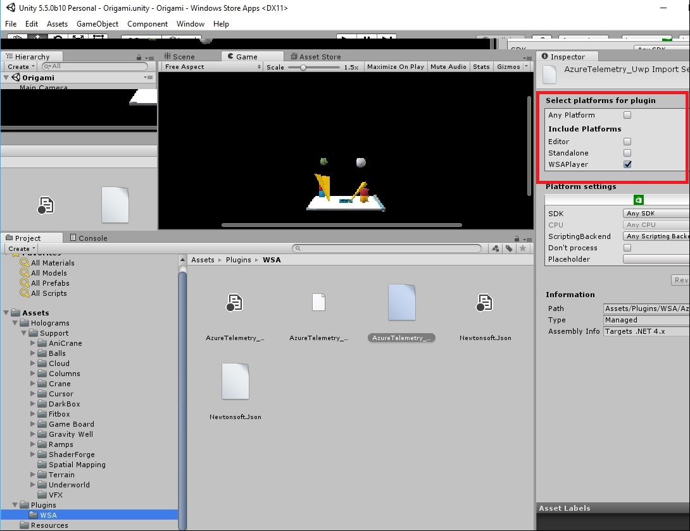
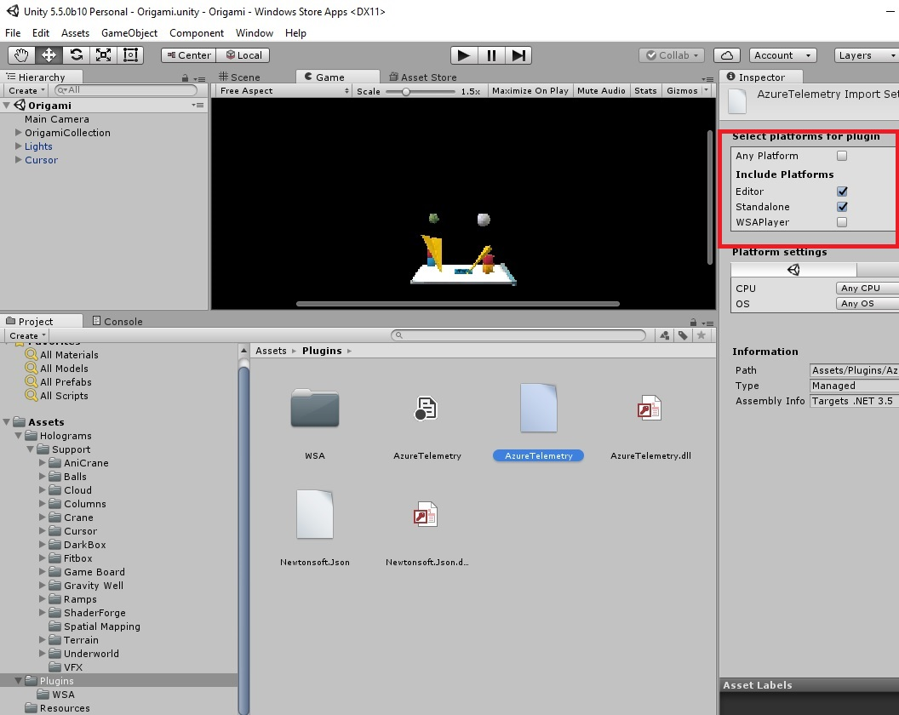
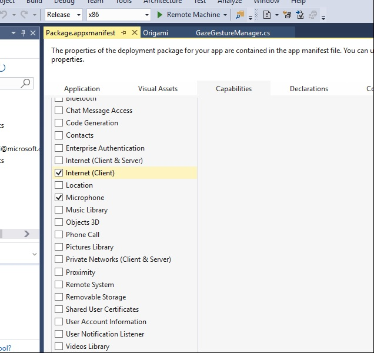
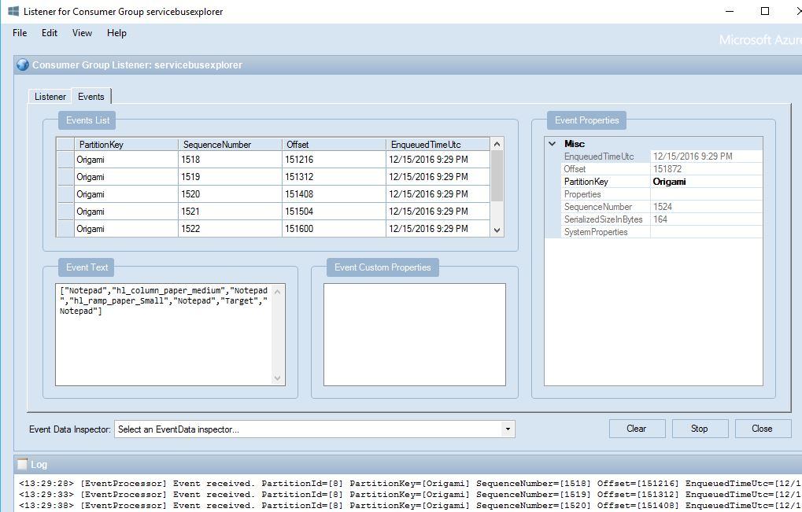

# Bringing Telemetry to HoloLens Applications
Developed jointly with Scott Haynie and Kevin Kennedy from the Microsoft HoloLens team.    
      
Telemetry and analytics are becoming a must for all applications, whether they are web, mobile or IOT. 
Analytics enable the application owner to monitor its health, figure out usage patterns and base the plans about how to improve the user experience on data. 

One of the ways to stream data to Azure is by building an end to end solution, that has the following:
* The device emitting data to an Azure Event Hub
* An Azure Streaming Advanced Analytics job pull the data from the Event Hub
* Azure Stream Analytics job that outputs to PowerBI

## Setting up the telemetry pipeline

You will need an azure account to follow along this article.
If you don’t have an account, you can [create a free azure account](https://docs.microsoft.com/en-us/azure/event-hubs/event-hubs-csharp-ephcs-getstarted).

## Creating the Azure Event Hub
 
1- Initially let’s create an event hub. You can do so by going to the [Azure Portal](https://portal.azure.com) and :
-> New -> Internet of Things -> Event Hubs.    

Detailed instructions can be found in the Get started with Event Hubs post.  
Make note of the name you are giving to the **namespace**; and the **name** given to the Event Hub. 
We will need it when setting up our AzureLogger UWP HoloLens library to stream telemetry.    
 
During the application development cycle, if you need to troubleshoot separately from other developers, you can set up more than one event hub **partition**, and use them to route the messages from separate HoloLens devices in different Evet Hub partitions.    
 
In the first steps of setting up the azure telemetry pipeline, tools like [Service Bus Explorer](https://blogs.msdn.microsoft.com/paolos/2015/03/02/service-bus-explorer-2-6-now-available/) can come handy to  check on whether the events are being streamed to azure. 
It is good practice to create an additional “Shared Access Policy" and not use the Root managed one.  
Keep note of the **policy name** and the **primary key** associated with it. It is again, one of the variables used to initialize the  AzureLogger library. 
	 

## Setting up Service Bus Explorer to monitor the telemetry 
To quickly get started with the Service bus explorer, you can watch the respective Channel 9 video: [Getting started with Service Bus. Part 3: Service Bus Explorer](https://channel9.msdn.com/Blogs/Subscribe/Getting-Started-with-Service-Bus-Part-3-Service-Bus-Explorer)
The connection string on the service bus explorer will be of the format:    

 
Endpoint=sb://NAMESPACe.servicebus.windows.net/;SharedAccessKeyName=POLICY_NAME;SharedAccessKey=POLICY_KEY     

Where the policy being used is the one on the namespace, not the event hub itself. 
 

 

Now that the Event Hub and the Service Bus Explorer are set up to receive events, and monitor them, let’s move on to modifying one of the Holographic Academy samples to emit telemetry. 

## Modifying the Holograms 101 samples to emit telemetry 
To follow along this tutorial, you’d need to have worked through the Holograms_101 samples in the Holographic academy up to “Chapter 4 - Voice”. 
Doing so, you will have an Origami solution with the following structure:

 

1. Download the Telemetry folder from this repository, and place it within the Origami folder.
If you need to fix the link to the Unity engine, unreferenced the dll, and reference it from: C:\Program Files\Unity\Editor\Data\Managed 
Building the Telemetry solution creates a Plugins folder inside the already existing Assets folder, and places there the AzureTelemetry.dll inside it, and the AzureTelemetry_uw.dll inside the WSA subfolder, for a structure like the picture below. 

 

2.	Launch Unity and open the Origami project
In the Project Panel click on Assets -> Plugins ->  AzureTelemetry.dll. 
Select the Editor and Standalone platforms from the Inspector panel. 
To configure the platform for the AzureLogger_uwp.dll click on Project Panel -> Plugins -> WSA -> AzureLogger_uwp.dll

 
 

3.	Build the Origami Universal App by going to File > Build Settings as instructed in the Holographic academy tutorials. 
4.	Modify the manifest of the Origami Universal app to include Internet capabilities 

 

5.	Start the Service Bus Explorer

6.	Deploy the app in the HoloLens, and look around the scene objects.  

You should start seeing events coming up in the Service Bus Explorer. 
  

