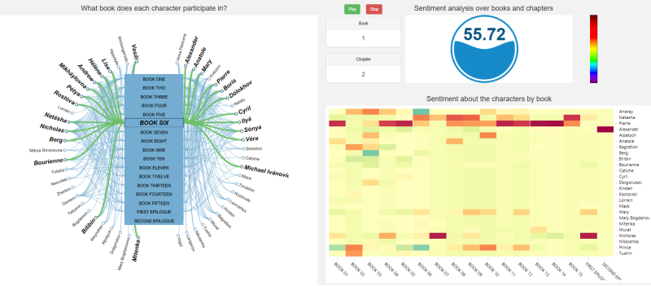

# Using R to Gain Insights into the Emotional Journeys in War and Peace

How do you read a novel in record time, and gain insights into the emotional journey of main characters, as they go through various trials and tribulations, as an exciting story unfolds from chapter to chapter?

I remembered my experiences when I start reading a novel, and I get intrigued by the story, and simply cannot wait to get to the last chapter. I also recall many conversations with friends on some of the interesting novels that I have read awhile back, and somehow have only vague recollection of what happened in a specific chapter. In this post, I’ll work through how we can use R to analyze the English translation of War and Peace.

War and Peace is a novel by Leo Tolstoy, and captures the salient points about Russian history from the period 1805 to 1812. The novel consists of the stories of five families, and captures the trials and tribulations of various characters (e.g. Natasha and Andre). The novel consists of about 1400 pages, and is one of the longest novels that have been written.

We hypothesize that if we can build a dashboard (shown below), this will allow us to gain insights into the emotional journey undertaken by the characters in War and Peace.

For example, using the dashboard below, and correlating it with the War and Peace story, we can see how Andrey falling in love with Natsha in Book 6 have created a green (positive) highlight in his life. We can also see how Natsha’s family bankruptcy in Book 6 overshadows her budding romance with Andrey. In addition, we can also observe how Pierre emotional journey stays red (negative), especially in Book 11-14, as he almost killed himself, and finally ending up in prison.

See this [blog](http://blog.revolutionanalytics.com/2016/12/war-and-peace.html) for more details
